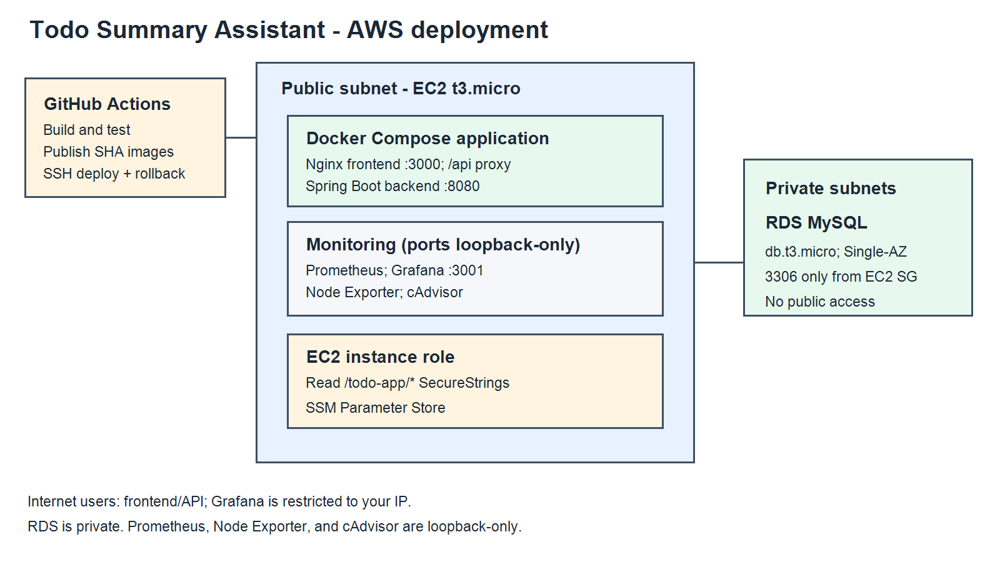

# AWS setup: one EC2 host and one private RDS database

This guide uses one Ubuntu 24.04 EC2 instance, one private MySQL RDS instance, Docker Compose, and the instance role for SSM access. Use the same AWS Region for EC2, RDS, and Parameter Store.



> **Cost note:** “Free tier” depends on account age, selected plan, Region, and total monthly usage. AWS currently describes 750 hours/month for eligible Single-AZ `db.t3.micro` instances for legacy Free Tier accounts; newer accounts use Free Plan credits and limits. Check the estimate and Billing console before creating resources. An Elastic IP/public IPv4 and data transfer may also incur charges. See [RDS Free Tier details](https://docs.aws.amazon.com/AmazonRDS/latest/UserGuide/Welcome.html) and [current RDS pricing](https://aws.amazon.com/rds/mysql/pricing/).

## 1. Create the EC2 security group

1. Open **VPC → Security groups → Create security group**.
2. Name it `todo-ec2-sg`; select the default VPC in your chosen Region.
3. Leave the default outbound rule (all traffic) in place.
4. Add inbound rules:

   | Type | Port | Source | Purpose |
   | --- | ---: | --- | --- |
   | Custom TCP | 3000 | `0.0.0.0/0` | React frontend |
   | Custom TCP | 3001 | **My IP** | Grafana |

5. Choose **Create security group**. Do not add port 22 or inbound rules for 8080, 9090, 9100, or 8085; only Grafana and the frontend are published, and the monitoring ports bind to localhost.

For temporary SSH debugging only, add inbound SSH port 22 with source **My IP** (`/32`), use the matching EC2 key pair, then remove that rule when finished. Automated deployment never uses SSH.

## 2. Create the EC2 IAM role for SSM and Parameter Store

1. Open **IAM → Roles → Create role**.
2. Select **AWS service → EC2 → Next**.
3. On the permissions page, search for and select the AWS managed policy **AmazonSSMManagedInstanceCore**. This lets the SSM Agent register and receive Run Command requests.
4. Choose **Add permissions → Create policy → JSON** and paste the policy below, replacing `REGION` and `ACCOUNT_ID` with your values. It grants only parameter reads under `/todo-app/`.

   ```json
   {
     "Version": "2012-10-17",
     "Statement": [
       {
         "Effect": "Allow",
         "Action": "ssm:GetParameter",
         "Resource": "arn:aws:ssm:REGION:ACCOUNT_ID:parameter/todo-app/*"
       }
     ]
   }
   ```

5. Choose **Next**, name the policy `TodoAppReadParameters`, and create it.
6. Return to role creation, refresh the policies list, select `TodoAppReadParameters` and **AmazonSSMManagedInstanceCore**, then choose **Next**.
7. Name the role `TodoAppEc2SsmRole` and choose **Create role**. Confirm the trusted entity is `ec2.amazonaws.com`.
8. The parameters below use the AWS-managed `aws/ssm` key. If you choose your own customer-managed KMS key instead, grant `kms:Decrypt` only on that key and update its key policy.

## 3. Set up GitHub OIDC and the deploy role

GitHub Actions assumes this role for deployment; it uses no AWS access keys.

1. In **IAM → Identity providers**, choose **Add provider**.
2. Select **OpenID Connect**. For Provider URL enter `https://token.actions.githubusercontent.com`; for Audience enter `sts.amazonaws.com`. Choose **Add provider**. If this provider already exists in the account, reuse it.
3. Open **IAM → Roles → Create role → Custom trust policy**. Replace `ACCOUNT_ID` with your AWS account ID and paste this trust policy. It permits only this repository's `main` branch:

   ```json
   {
     "Version": "2012-10-17",
     "Statement": [{
       "Effect": "Allow",
       "Principal": {"Federated": "arn:aws:iam::ACCOUNT_ID:oidc-provider/token.actions.githubusercontent.com"},
       "Action": "sts:AssumeRoleWithWebIdentity",
       "Condition": {
         "StringEquals": {
           "token.actions.githubusercontent.com:aud": "sts.amazonaws.com",
           "token.actions.githubusercontent.com:sub": "repo:Pragathi-0120/TodoSummaryAssistant:ref:refs/heads/main"
         }
       }
     }]
   }
   ```

4. Choose **Next** and create an inline permission policy named `TodoAppGitHubDeploy`. Replace `REGION`, `ACCOUNT_ID`, and `INSTANCE_ID` with the EC2 instance values:

   ```json
   {
     "Version": "2012-10-17",
     "Statement": [
       {
         "Effect": "Allow",
         "Action": "ssm:SendCommand",
         "Resource": [
           "arn:aws:ssm:REGION::document/AWS-RunShellScript",
           "arn:aws:ec2:REGION:ACCOUNT_ID:instance/INSTANCE_ID"
         ]
       },
       {
         "Effect": "Allow",
         "Action": ["ssm:GetCommandInvocation", "ssm:ListCommandInvocations"],
         "Resource": "*"
       }
     ]
   }
   ```

   For the AWS-owned public document `AWS-RunShellScript`, the account field in its ARN is intentionally empty. The wildcard is needed for the two command-result lookup APIs; the only command that can be sent is AWS-RunShellScript and only to the named instance. This follows AWS's [Run Command IAM policy examples](https://docs.aws.amazon.com/systems-manager/latest/userguide/security_iam_id-based-policy-examples.html).

5. Name the role `TodoAppGitHubDeployRole`, create it, then attach the inline policy. Copy its ARN for the `AWS_ROLE_ARN` GitHub secret.

## 4. Launch EC2 and install Docker

1. Open **EC2 → Instances → Launch instances**.
2. Name the instance `todo-app`.
3. Choose **Ubuntu Server 24.04 LTS**, 64-bit x86, and an eligible micro size such as `t3.micro` if offered for your account/Region.
4. A key pair is optional because SSH is not used. If you want the temporary SSH debugging option, create a key pair and store the private key securely outside the repository.
5. Under **Network settings**, choose the default VPC and a public subnet, enable public IPv4, and select `todo-ec2-sg`.
6. Under **Configure storage**, choose a small gp3 root disk (for example, 20 GiB; check the current free allowance).
7. Under **Advanced details → IAM instance profile**, select `TodoAppEc2SsmRole`.
8. In **User data**, paste the install script below. Choose **Launch instance**.

   ```bash
   #!/bin/bash
   set -euxo pipefail
   apt-get update
   DEBIAN_FRONTEND=noninteractive apt-get install -y ca-certificates curl gnupg awscli git snapd
   install -m 0755 -d /etc/apt/keyrings
   curl -fsSL https://download.docker.com/linux/ubuntu/gpg \
     | gpg --dearmor -o /etc/apt/keyrings/docker.gpg
   chmod a+r /etc/apt/keyrings/docker.gpg
   . /etc/os-release
   echo "deb [arch=$(dpkg --print-architecture) signed-by=/etc/apt/keyrings/docker.gpg] https://download.docker.com/linux/ubuntu ${UBUNTU_CODENAME:-$VERSION_CODENAME} stable" \
     > /etc/apt/sources.list.d/docker.list
   apt-get update
   DEBIAN_FRONTEND=noninteractive apt-get install -y \
     docker-ce docker-ce-cli containerd.io docker-buildx-plugin docker-compose-plugin
   systemctl enable --now docker
   usermod -aG docker ubuntu
   snap list amazon-ssm-agent >/dev/null 2>&1 || snap install amazon-ssm-agent --classic
   systemctl enable --now snap.amazon-ssm-agent.amazon-ssm-agent.service
   ```

9. Wait for instance status checks to pass. Open **Systems Manager → Fleet Manager → Managed nodes** and confirm the instance is online. If it is missing, check the instance role, SSM Agent status, and outbound network access.
10. In **EC2 → Elastic IPs → Allocate Elastic IP address**, allocate an address. Select it, choose **Actions → Associate Elastic IP address**, select `todo-app`, and associate it. Record the **instance ID** (`i-...`) for the GitHub secret `EC2_INSTANCE_ID`; the Elastic IP is used by people opening the frontend.
11. Use **Systems Manager → Fleet Manager → Node actions → Start terminal session** to verify `docker --version`, `docker compose version`, `git --version`, and `aws sts get-caller-identity`. The returned identity must be the EC2 role, not a user access key.

## 5. Create private subnets and an RDS subnet group

RDS needs a DB subnet group spanning at least two Availability Zones even though the DB itself will be Single-AZ.

1. Open **VPC → Subnets → Create subnet**. Select the same VPC used by EC2.
2. Create two subnets in two different Availability Zones using unused IPv4 CIDRs inside the VPC range (for example, `10.0.10.0/24` and `10.0.20.0/24` only if those ranges are free in your VPC).
3. Open **VPC → Route tables → Create route table**; name it `todo-db-private-rt` and select the same VPC.
4. Select the new route table → **Routes**. Keep only the VPC `local` route; do not add an Internet Gateway or NAT Gateway route.
5. Under **Subnet associations → Edit subnet associations**, select both new subnets and save.
6. Open **RDS → Subnet groups → Create DB subnet group**. Name it `todo-db-private-subnets`, select the same VPC, and add the two private subnets (one in each AZ).

## 6. Create the RDS security group and database

1. Open **VPC → Security groups → Create security group**. Name it `todo-rds-sg`, choose the same VPC, and leave outbound as default.
2. Add one inbound rule: **MySQL/Aurora**, port `3306`, source **Custom → `todo-ec2-sg` security group**. Do not use an IP address or `0.0.0.0/0`. Create the group.
3. Open **RDS → Databases → Create database → Standard create**.
4. Choose **MySQL**, a current MySQL 8.0 release, and the Free Tier/Free Plan option if shown.
5. Select **Single DB instance** (Single-AZ), a `db.t3.micro` eligible for your account, gp storage around 20 GiB, and disable storage autoscaling for this small assessment deployment.
6. Set a database name such as `todo_db`, master username `todo_user`, and a strong password. Do not reuse a real password from another service.
7. In **Connectivity**, choose the same VPC, select `todo-db-private-subnets`, set **Public access: No**, and select **Choose existing security group → todo-rds-sg** (remove any default RDS security group that allows a public IP range).
8. Set **Availability & durability: Single-AZ DB instance deployment**. Under backups, leave automated backups enabled (for example 7 days) if the account offers it; review backup storage cost.
9. Review the estimate and choose **Create database**. Wait until status is **Available**. Copy the endpoint hostname from **Connectivity & security**. Confirm Publicly accessible is **No** and `todo-rds-sg` has only the EC2 security-group rule.

## 7. Store runtime values in Parameter Store

The deploy script reads these exact parameter names with the EC2 role. Create each in the same Region as EC2:

1. Open **Systems Manager → Parameter Store → Create parameter**.
2. Enter the name and value below. Choose **SecureString**, leave the KMS key as `alias/aws/ssm`, and choose **Create parameter**. Never put these values in GitHub, `.env.example`, or the repository.

   | Name | Value to enter |
   | --- | --- |
   | `/todo-app/db-url` | `jdbc:mysql://RDS_ENDPOINT:3306/todo_db?useSSL=true` (replace endpoint) |
   | `/todo-app/db-username` | RDS master username (or an application DB user) |
   | `/todo-app/db-password` | Corresponding DB password |
   | `/todo-app/cohere-api-key` | Cohere API key |
   | `/todo-app/slack-webhook-url` | Slack Incoming Webhook URL |
   | `/todo-app/grafana-admin-user` | `admin` or your chosen user |
   | `/todo-app/grafana-admin-password` | A strong Grafana password |

   The first five reflect the application’s runtime configuration; the last two configure Grafana. A separate least-privilege MySQL application user is preferable to using the RDS master user after initial setup.

3. From EC2, test one value without printing it: `aws ssm get-parameter --region YOUR_REGION --name /todo-app/db-url --with-decryption --query 'Parameter.Name' --output text`. It should return the parameter name.

## 8. Configure GitHub and Docker Hub

1. Create two **public** Docker Hub repositories named `todo-summary-backend` and `todo-summary-frontend` under your Docker Hub account. Public repositories let EC2 pull without storing Docker Hub credentials on the server.
2. In GitHub, open `Pragathi-0120/TodoSummaryAssistant` → **Settings → Secrets and variables → Actions → New repository secret**. Create only these repository secrets:

   - `DOCKERHUB_USERNAME` — Docker Hub account name
   - `DOCKERHUB_TOKEN` — Docker Hub access token with read/write access for these repositories
   - `AWS_ROLE_ARN` — ARN for `TodoAppGitHubDeployRole`
   - `AWS_REGION` — AWS Region containing the SSM parameters
   - `EC2_INSTANCE_ID` — EC2 instance ID (`i-...`)

3. In **Docker Hub → Account Settings → Personal access tokens**, create a token with read/write access and use it as `DOCKERHUB_TOKEN`.
4. Push to `main`. The workflow runs tests on every branch/PR and publishes/deploys only a push to `main`. GitHub's deploy job assumes the restricted role using OIDC, then invokes SSM Run Command on only the selected EC2 instance.

## 9. Initial deployment and rollback behavior

The first deploy's SSM command clones this public repository into `/opt/todo-app` (later runs fetch the requested commit), checks out the exact commit SHA, and runs `scripts/deploy.sh`. The script reads SecureStrings using the EC2 instance role, creates `/opt/todo-app/.env` with mode `600`, and starts Compose without the `local` profile.

The first deployment has no known-good image tag, so a failed deploy reports that rollback was skipped and fails. After a healthy deploy, the script saves `.deployed_tag`; later failures restore that tag, retry health checks, and still fail the GitHub job. Do not delete `.deployed_tag` if you want rollback history.

## 10. Cleanup

Delete resources in this order to avoid dependencies and ongoing charges:

1. In **RDS → Databases**, select the database → **Actions → Delete**. For a disposable assessment DB, choose whether to take a final snapshot; delete automated backups only if they are no longer needed. Confirm deletion.
2. In **EC2 → Instances**, select `todo-app` → **Instance state → Terminate instance**. Confirm termination.
3. In **EC2 → Elastic IPs**, release the address after the instance is terminated.
4. In **Systems Manager → Parameter Store**, delete the seven `/todo-app/` parameters.
5. In **EC2/VPC → Security groups**, delete `todo-rds-sg` and `todo-ec2-sg` after RDS and EC2 are gone. Delete the private DB route table, DB subnet group, and private subnets if you created them only for this stack.
6. In **IAM → Roles**, delete `TodoAppEc2SsmRole` and its policy `TodoAppReadParameters`, then delete `TodoAppGitHubDeployRole` and its inline policy `TodoAppGitHubDeploy`. In **IAM → Identity providers**, delete the GitHub provider only if no other repository or role uses it.
7. In Docker Hub, delete the two public image repositories if they are no longer needed. Remove the GitHub Actions secrets from repository settings.

Do not delete a VPC or route table that is shared with other resources. Confirm RDS snapshots and backup retention are no longer required before removing them.
